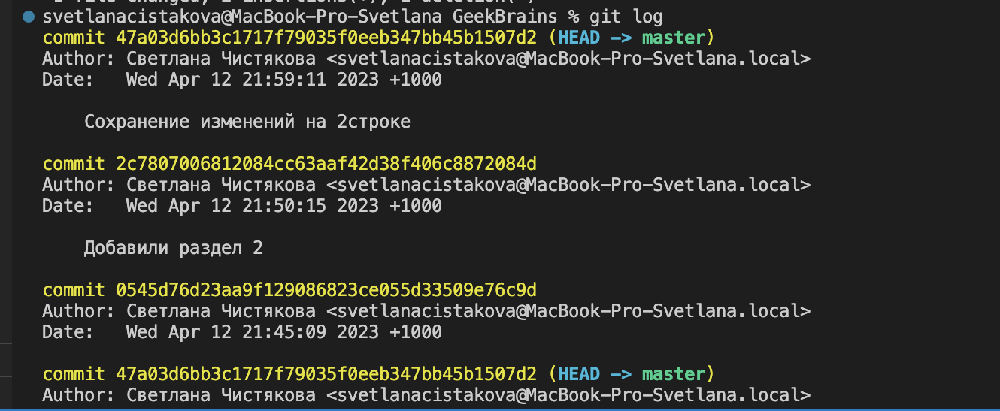
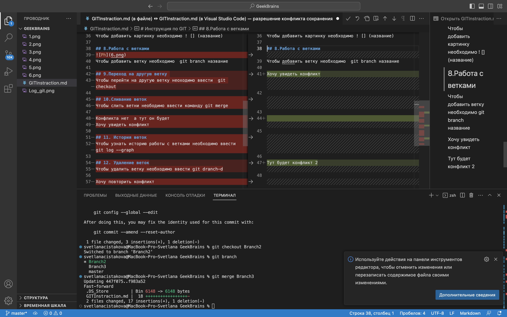

# Инструкция по GIT

## 1.Инициализация репозиторий

открыть терминал и ввести команду git init

## 2.Сохранение изменений в файле 

чтобы сохранить изменения необходимо ввести комаеду git add
 
 ## 3.Установка и настройка GIT 
  
 Просмотр изменений - git status

 Перечислить все новые изменения git diff 
  

 ## 4.Проиндексация изменений 
 

 Чтобы зафиксировать новые изменения вводим git commit --ad(собщение)

 ## 5.Просмотр истории 

 

 Введи git log чтобы посмотреть историю сохранений 

 ## 6.Перемещение между сохранениями 
 
Необходимо ввести git checkout (номер сохранения)

## 7.Добавление картинки 

Чтобы добавить картинку необходимо ! [] (название)

## 8.Работа с ветками 
Чтобы добавить ветку необходимо  git branch название 

## 9.Переход на другую ветку 
Чтобы перейти на другую ветку неоходимо ввести  git checkout

## 11. История веток 
Чтобы узнать историю работы с ветками необходимо ввести git log --graph

## 12. Удаление веток
Чтобы удалить ветку необходимо ввести git dranch-d

### Конфликт
 

## 13. Работа с удаленным репозиторием 
Чтобы регистрировать удаленный репозиторий необходимо перейти  на GitHab и там ввести git clone и ссылку 

### Скачать всю историю из удаленного репозитория 
необходимо ввести git merge" репозиторий"

### Внесение изменений в ветку из удаленного репозитория 
 Необходимо ввести git push

 ### Загрузка всех изменений в локальной ветки в удаленный репозиторий 
 
 Неоьходимо ввести git pull
